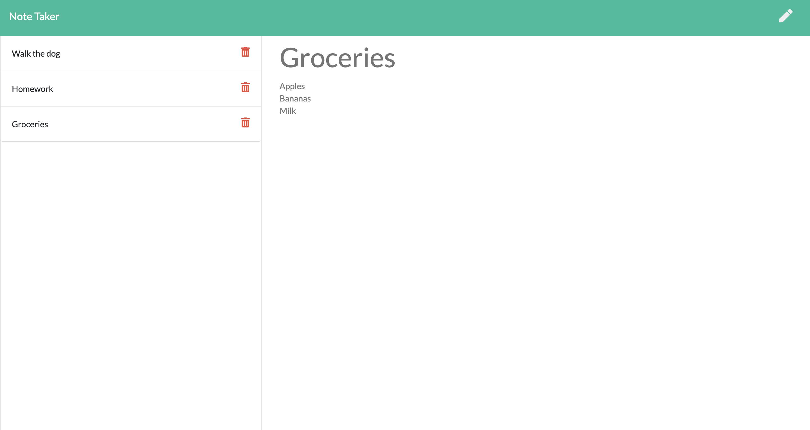

# Note Taker

## Purpose of the Assignment 

To create a note-taker application that can save, display, and delete notes. 

## What I Did and Why 

Lines 2-6: Declares const names and their corresponding dependent files and packages. 

Line 9: Sets up Express. 

Line 12: Sets the port. 

Lines 15-16: Sets up Express to handle data parsing.

Line 19: Makes the static files public.

Line 22: Gets and returns the index.html file.

Line 25: Gets and returns the notes.html file.

Line 28: Gets and returns the ds.json file.

Lines 31-37: Create const newNote from what is in req.body. Give that newNote a nanoid. Push it to db. Write the db.json file to contain the stringified db. Post newNote.  

Lines 40-45: Create const deleted by referencing the id. Redefine db to equal db filtered for notes that have not been deleted. Rewrite the db.json file to contain the new stringified db. Delete deleted and return the new db. 

Line 48: Tells the server to begin listening on the established port. 

## Screenshot

## Link to Deployed Application 
https://immense-scrubland-11371.herokuapp.com/ 